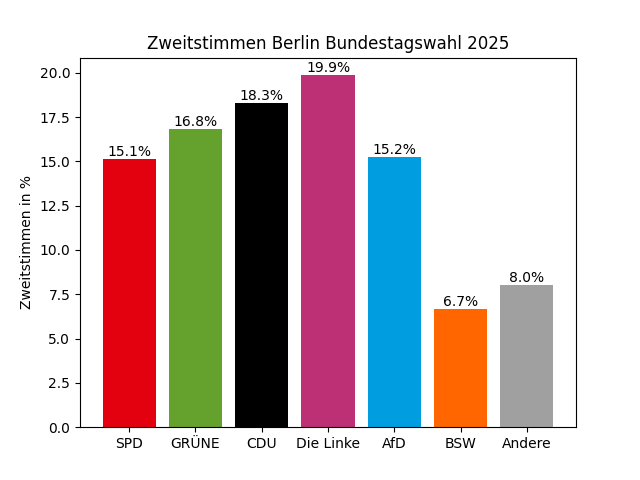

title: "Matplotlib mit Pandas (Zweitstimmen)"
stage: draft
timevalue: 1.25
difficulty: 2
requires: plt-DiagrammArten, pd-Statistik
---

[SECTION::goal::idea]
Ich verstehe, wie ich Pandas-Daten und Matplotlib zusammenbringe, um sinnvolle Visualisierungen
zu erstellen.
[ENDSECTION]


[SECTION::background::default]
Bisher haben Sie Pandas zur Analyse von Daten und Matplotlib zum Erstellen verschiedener Diagramme
getrennt kennengelernt.  
In der Praxis nutzt man beide Bibliotheken oft zusammen, 
wenn es darum geht Datensätze zu visualisieren.
[ENDSECTION]


[SECTION::instructions::detailed]
Laden Sie den Datensatz der *Zweitstimmen*  
[Bundestagswahl 2025 in Berlin](https://www.govdata.de/suche/daten/bundestagswahl-2025-in-berlin-nach-wahlbezirken-endgultiges-ergebnis):
```python
import pandas as pd
import matplotlib.pyplot as plt

zweitstimmen_df = pd.read_csv("Pfad/zur/Berlin_BT25_W2.csv", sep=";")
```

Wir betrachten die folgenden Parteien:
```python
party_cols = [
    'SPD', 'GRÜNE', 'CDU', 'Die Linke', 'AfD', 'FDP', 'Tierschutzpartei',
    'Die PARTEI', 'Team Todenhöfer', 'FREIE WÄHLER', 'Volt', 'MLPD', 'BüSo',
    'SGP', 'BÜNDNIS DEUTSCHLAND', 'BSW', 'MERA25', 'PdF'
]
```

[ER] Summieren Sie für die nächsten Aufgabe die Stimmen der Parteien auf ihre Gesamtzahl pro
Partei auf (`Series`).

[ER] Daten schnell zu plotten ist mit der eingebauten
[`plot()`](https://pandas.pydata.org/docs/reference/api/pandas.Series.plot.html#pandas.Series.plot)
Methode recht einfach.
Schauen Sie sich die Dokumentation dazu an und plotten Sie die Stimmen der einzelnen Parteien als
*Säulendiagramm*.

[NOTICE]
Diese eingebaute Methode von Pandas zum plotten nutzt im Hintergrund auch Matplotlib!
Daher kann es gut sein, dass Sie `plt.show()` anwenden müssen, um sich den Plot anzeigen zu lassen,
auch wenn die Dokumentation das nicht explizit erwähnt.
[ENDNOTICE]

Diese Methode der Visualisierung ist kompakt und schnell, gut also wenn man sich die Daten nur kurz
angucken möchte.
Wenn man jedoch die komplette Kontrolle über die Visualisierung haben möchte oder die
Visualisierung selbst komplexer ist, dann ist es sinnvoll Matplotlib selbst zu benutzen.

[ER] Setzen Sie das gleiche Diagramm mit der 
[`bar()`](https://matplotlib.org/stable/api/_as_gen/matplotlib.axes.Axes.bar.html) 
(explizite Schreibweise) statt mit der Pandas `plot()`-Methode um.

Das geht aber noch deutlich geschickter.
Im Folgenden werden Sie diese Grafik nachbauen:
</img>

[ER] Rechnen Sie dafür für jede Partei den Prozentwert aus.

[ER] Unterteilen Sie dann erst einmal alle Parteien in `major_parties` also die, die mindestens 5%
haben und die, die darunter liegen `minor_parties`.

[ER] Summieren Sie die `minor_parties` zusammen und fügen Sie diese als Spalte "Andere"
zu `major_parties` hinzu.

Um die Balken später farbig darzustellen brauchen Sie eine Liste, die (in der gleichen 
Reihenfolge wie `major_parties`) die Farben für die Parteien enthält.
Mit dem folgenden Code kriegen Sie eine solche Liste:
```python
party_colors = {
    "SPD": "#E3000F",
    "GRÜNE": "#64A12D",
    "CDU": "#000000",
    "Die Linke": "#BE3075",
    "AfD": "#009EE0",
    "FDP": "#FFED00",
    "BSW": "#FF6600",
    "Andere": "#A0A0A0"
}
colors = [party_colors.get(p, "#A0A0A0") for p in major_parties.index]
```

[ER] Plotten Sie das Säulendiagramm mit den Parteien und den richtigen Farben.

[EQ] Noch zeigt das Diagramm nicht an, wie viel Prozent eigentlich jede Partei hat, man kann
es nur ungefähr schätzen.
Änderen Sie ihren Code, sodass der Rückgabewert von `ax.bar()` in der Variable `bars` gespeichert
wird.
Was genau ist dieser Rückgabewert?

[EQ] Nutzen Sie `bars`, um folgenden Code einzubinden. Beschreiben Sie was dieser tut:
```python
for bar, value in zip(bars, major_parties.values):
    ax.text(
        bar.get_x() + bar.get_width() / 2,
        bar.get_height(),
        f"{value:.1f}%",
        ha="center", va="bottom", fontsize=10
    )
```

[ER] Geben Sie dem Diagramm den Titel "Zweitstimmen Bundestagswahl Berlin 2025" und die
Y-Achsenbeschriftung "Zweitstimmen in %".

### Kuchendiagramm Wählende

Nun möchten wir ein Kreisdiagramm erstellen, welches visualisiert, wie viel Prozent der
Wahlberechtigten wählen waren und wie viele nicht.

[EQ] Welche 2 Spalten sind dafür relevant? Wie können Sie den Anteil an Nicht-Wählern berechnen?

[ER] Berechne Sie die Wähler und Nicht-Wähler. Plotten Sie diese als Kreisdiagramm.
Setzen Sie die `labels` entsprechend auf "Wählende" und "Nicht-Wählende".
Zeigen Sie mit `autopct` die Prozentsätze im Kreisdiagramm an.
[ENDSECTION]


[SECTION::submission::information]
[INCLUDE::/_include/Submission-Quellcode.md]
[INCLUDE::/_include/Submission-Markdowndokument.md]
[ENDSECTION]


[INSTRUCTOR::Kann Pandas-Daten und Matplotlib verbinden?]
[INCLUDE::ALT:]
[ENDINSTRUCTOR]