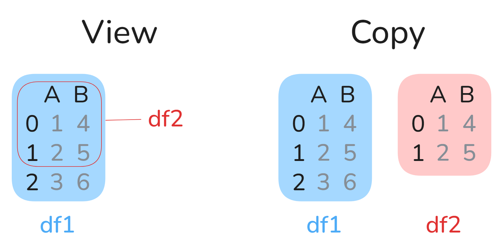

title: "pandas: Daten ändern"
stage: beta
timevalue: 1.75
difficulty: 2
requires: pd-Datenselektion
---

[SECTION::goal::idea]
Ich verstehe, wie man Daten in Pandas korrekt verändert.

Ich verstehe, wie Pandas beim Thema "Kopien (`Copy`) und Sichten (`View`)" abweicht
von dem, was ein sinnvolles mentales Modell erwarten ließe.
[ENDSECTION]


[SECTION::background::default]
Pandas-Methoden weisen ein oft verblüffendes Verhalten auf, wenn man Daten ändert,
denn beim vorherigen Selektieren bekommt man manchmal eine _Sicht_ auf den darunterliegenden
Dataframe (über die man Daten im Dataframe ändern kann) und manchmal 
eine _Kopie_ der jeweiligen Teile des Dataframes (sodass eine Änderung nur die Kopie
betrifft und verpufft, wenn man eigentlich den ursprünglichen Dataframe ändern wollte).

Diese Aufgabe lehrt das nötige Verständnis, um Daten _erfolgreich_ zu bearbeiten.
[ENDSECTION]


[SECTION::instructions::loose]
Laden Sie zunächst den 
[Datensatz der Erststimmen Bundestagswahl 2025](https://www.govdata.de/suche/daten/bundestagswahl-2025-in-berlin-nach-wahlbezirken-endgultiges-ergebnis)
wie in
[PARTREF::pd-Einführung] beschrieben in Ihre Python-Umgebung:
```python
import pandas as pd
erststimmen_df = pd.read_csv("Pfad/zur/Berlin_BT25_W1.csv", sep=';')
```

Um Daten in einer zusammengesetzten Datenstruktur gezielt zu bearbeiten, muss man die Daten
Selektieren (wie in den vorherigen Aufgaben gelernt) und ihnen dann einen Wert zuweisen.
Wie das Bearbeiten aussehen kann, sieht man auch gut an z.B. Python-Listen:
```python
original_list = [1, 2, 3]
original_list[0] = 999 # Selektion ([0]) wird Wert zugewiesen (= 999)
```

Im Prinzip funktioniert das Bearbeiten in Pandas auch so:
```python
erststimmen_df.loc[0,"Bezirksname"] = "Bearbeitet"  
# Selektion (.loc[0,"Bezirksname"]) wird Wert zugewiesen (= "Bearbeitet")
```

[ER] Setzen Sie mithilfe von `loc()` die ganze Spalte "Stimmart" überall auf "Bearbeitet".

Pandas Verhalten ist jedoch nicht in allen Hinsichten wie man es von klassischen
Python-Datenstrukturen erwarten würde.
Diese Aufgabe vermittelt deshalb das Verständnis für das Verhalten von Pandas und die "Best
Practices" die sich daraus ergeben.

Bevor Sie sich mit Pandas spezifisch beschäftigen, müssen Sie zwei fundamentale Konzepte verstehen,
die in Pandas allgegenwärtig sind: `View` und `Copy`

### Was ist eine Kopie (`Copy`)?

Eine Kopie erstellt eine unabhängige Reproduktion der Daten.
Wenn Sie z.B. ein Dokument fotokopieren und dann auf der Kopie herumkritzeln, bleibt das
Originaldokument unverändert.

Technisch gesehen: 
Eine Kopie reserviert neuen Speicherplatz und füllt ihn mit den duplizierten Daten. 
Änderungen an der Kopie bleiben lokal und wirken sich nicht auf die Originaldaten aus.

### Was ist eine Sicht (`View`)?

Eine Sicht ist eine Möglichkeit, auf einen Teil der Originaldaten zu verweisen, ohne diese zu kopieren.
Stellen Sie sich vor, Sie legen eine Lupe auf ein Dokument.
Was Sie sehen, ist nicht getrennt, sondern ein Teil des Originals.
Wenn Sie unter der Lupe nun etwas kritzeln, verändert sich nicht nur das, was Sie sehen, sondern
auch das Originaldokument.

In technischen Begriffen:
Eine Sicht ist eine Referenz auf die Originaldaten (bzw. einen Teil der Originaldaten) im Speicher. 
Wenn Sie eine Sicht ändern, ändern Sie direkt die Originaldaten.

</img>


### Die Python-Art

Python arbeitet standardmäßig mit Objektreferenzen statt mit Kopien.
Wenn Sie z.B. eine Selektion von einer Python-Liste nehmen, dann können Sie damit rechnen, dass
diese eine `View` ist und keine `Copy`:
```python
original_list = [1, 2, 3]
view_reference = original_list[0]  # Dies ist eine View, keine Kopie
view_reference = 999
print(original_list)  # Ausgabe: [999, 1, 3] Das Original wurde verändert!
```

Da diese Selektionen Sichten sind, schlagen Änderungen an der Selektion auf das Originalobjekt
durch.

### Die Pandas-Art

Doch Pandas weicht von diesem Ideal ab, bei dem jede Selektion eine Sicht auf Daten ist.
Das ist die Ursache für die meisten Verwirrungen, die im Umgang mit Pandas entstehen.
Pandas garantiert nämlich nicht, dass jede Selektion eine Sicht ist:
Manchmal (und bei manchen Ausdrücken sogar _unvorhersehbar_) werden Kopien zurückgegeben 
anstatt Sichten (`Views`).

[EQ] Lesen Sie die Abschnitte 
[Returning a view versus a copy](https://pandas.pydata.org/docs/user_guide/indexing.html#returning-a-view-versus-a-copy) 
und 
[Why does assignment fail when using chained indexing?](https://pandas.pydata.org/docs/user_guide/indexing.html#why-does-assignment-fail-when-using-chained-indexing)
und zitieren Sie die Textstelle, in der darüber gesprochen wird, ob `View` oder `Copy` zurückgegeben
werden.

Dieses Verhalten, unzuverlässig `View` oder `Copy` zurückzugeben, führt nicht selten zu
fehleranfälligem Code, wenn man nicht weiß, wie man damit umgehen soll.

### Chained Indexing / Chained Assignment

[NOTICE]
Informationen zu den folgenden Aufgaben finden Sie in der Pandas-Dokumentation unter
[Why does assignment fail when using chained indexing](https://pandas.pydata.org/docs/user_guide/indexing.html#why-does-assignment-fail-when-using-chained-indexing)
und 
[Chained Assignment - Copy-On-Write](https://pandas.pydata.org/docs/user_guide/copy_on_write.html#chained-assignment)
[ENDNOTICE]

[EQ] Erklären Sie, was "Chained Indexing" ist.

```python
erststimmen_df[erststimmen_df["Bezirksname"] == "Mitte"]["Bezirksnummer"] = -1

erststimmen_df.iloc[:50].loc[:, "Wahlbezirk"] = -1
```

Beide Beispiele verwenden "Chained Indexing" und versuchen, auf dieser Basis Werte an das 
originale `erststimmen_df` zuzuweisen.
Probieren Sie diese Beispiele aus und betrachten Sie `erststimmen_df`.

[EQ] Wahrscheinlich hat nur eins oder gar keins der beiden Beispiele das `erststimmen_df`
verändert.
Erklären Sie anhand des ersten Ausdrucks das Problem von "Chained Indexing".

[NOTICE]
Solche ungewünschten Schreibweisen wie "Chained Indexing" werden oftmals (aber auch nicht immer)
mithilfe der `SettingWithCopyWarning` von Pandas in der Konsole sichtbar gemacht.
Die Warnung dient also als Indikator, dass Sie Codeschnipsel nicht sauber formuliert haben.
[ENDNOTICE]

[EQ] Lesen Sie die
[Dokumentation](https://pandas.pydata.org/docs/user_guide/indexing.html#evaluation-order-matters).
Wie sollte man Fälle von "Chained Indexing" sauber umformulieren?

[HINT::Sauberes Umformulieren]
Suchen Sie in der Dokumentation nach folgendem Abschnitt:
"The following is the recommended access method using `.loc` for multiple items (using `mask`) and 
a single item using a fixed index:".
[ENDHINT]

[ER] `erststimmen_df["Bezirksname"][0] = "Mitte Neu"` formulieren Sie diesen Ausdruck sauber um,
sodass Sie in der Konsole keine `SettingWithCopyWarning` kriegen.

[ER] `erststimmen_df[erststimmen_df["Bezirksname"] == "Mitte"]["Bezirksnummer"] = 999` formulieren
Sie auch diesen Ausdruck sauber um, sodass er keine `SettingWithCopyWarning` wirft.

### Subsets

```python
df = pd.DataFrame({"a": [1, 2, 3], "b": [4, 5, 6]})
subset = df["a"]
subset[0] = 999
```
Hier wäre die Erwartung, dass `subset` eine View ist, und sich Änderungen direkt auf `df` auswirken. 

[EQ] Erklären Sie, inwiefern dieses Beispiel eigentlich ein Exemplar des
"Chained Assignment"-Problems ist.

[ER] Trotzdem möchte man als Programmierer die Möglichkeit haben, explizit Kopien von
relevanten Teilen eines `DataFrame` zu erstellen.
Dazu gibt es die Methode
[`copy()`](https://pandas.pydata.org/docs/reference/api/pandas.DataFrame.copy.html#pandas.DataFrame.copy).
Ändern Sie das vorherige Beispiel so ab, dass `subset` eine echte Kopie von `df` ist.

### Best Practices

- Benutzen Sie `loc()` oder `iloc()` für direkte Änderungen am Original:
  `df.loc[df["A"] > 1, "B"] = 10`
- Vermeiden Sie Chained Indexing (`df[][] = ...`)
- Verwenden Sie `copy()` explizit, wenn Sie sicher sein wollen, eine unabhängige Kopie zu erhalten.
- Achten Sie auf die `SettingWithCopyWarning`. 
  Sie signalisiert potenziell fehleranfällige Operationen.
- Mit aktiviertem Copy-on-Write (CoW) bleiben Originaldaten bei Bearbeitungen sicher unangetastet.

[ER] Korrigieren Sie folgenden Code-Ausschnitt, der Chained Indexing verwendet, 
indem Sie die Best Practices anwenden:

```python
erststimmen_df[erststimmen_df["Wählende"] > 500][erststimmen_df["Gültige Stimmen"] > 400]["SPD"] = -999
```

### Copy On Write (Pandas-Verhalten ab Version 3.0 oder auf Verlangen)

<!-- TODO_3: Copy-on-write: Wenn Pandas 3.0 erschienen ist, nächsten Satz anpassen: -->
Es gibt einen Modus in Pandas, der ab Version `3.0` (erscheint Ende 2025) auch der Standard sein wird:
[Copy On Write](https://pandas.pydata.org/docs/development/copy_on_write.html)

Aus unserer Python-Welt sind wir gewöhnt, immer eine `View` zu bekommen.
Pandas hat bis jetzt unvorhersehbar manchmal eine `View` und manchmal eine `Copy` zurückgegeben.
Mit "Copy on Write" soll sich das ändern: Jede Selektion gibt eine `Copy` zurück.

[NOTICE]
Unter der Haube von "Copy on Write" wird nicht wirklich jedes Mal eine Kopie gemacht aus 
Effizienzgründen.
Es garantiert aber, dass sich die Selektionen wie Kopien verhalten, weshalb der Unterschied für uns
Pandas-Anfänger erstmal uninteressant ist. 
Er wird wichtig, wenn man mit großen Datenmengen arbeitet.
[ENDNOTICE]

[ER] Aktivieren Sie "Copy on Write" im Code.

[EQ] Ändert sich damit was an den genannten Best Practices?
Begründen Sie.

[EQ] Testen Sie beide Beispiele aus dem "Chained Indexing"-Abschnitt mit aktiviertem "Copy On Write".
Beschreiben Sie, ob und wie sich das Verhalten ändert.

[WARNING]
Um Pandas-Code korrekt zu verstehen, muss man vielen Fällen also den Status der
"Copy on Write"-Einstellung klären.
Auch viele Jahre nach dem Erscheinen von Pandas 3.0 wird es noch viel Code auf Basis von
Pandas 1 (1.5.3 erschien Januar 2023) und Pandas 2 (2.3.3 erschien September 2025) geben!
[ENDSECTION]


[SECTION::submission::reflection]
[INCLUDE::/_include/Submission-Quellcode.md]
[INCLUDE::/_include/Submission-Markdowndokument.md]
[ENDSECTION]


[INSTRUCTOR::Pandas-Verhalten bei Datenselektion und -schreiben verstanden?]
[INCLUDE::ALT:]
[ENDINSTRUCTOR]