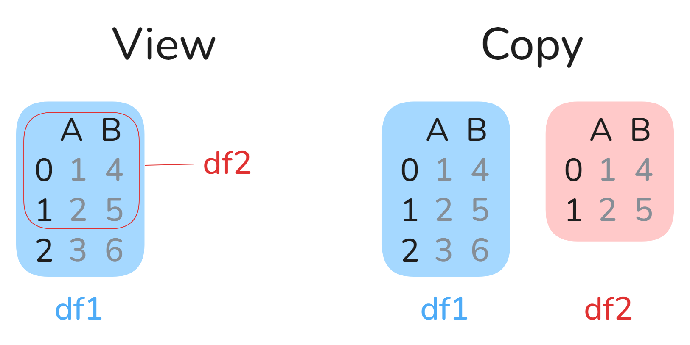

title: "pandas: Daten ändern"
stage: beta
timevalue: 0.75
difficulty: 2
assumes: pd-Datenselektion2
---

[SECTION::goal::idea]
Ich verstehe, wie man Daten in Pandas korrekt verändert.

Ich verstehe, wie Pandas beim Thema "Kopien (`Copy`) und Sichten (`View`)" abweicht
von dem, was ein Python-übliches mentales Modell erwarten ließe.
[ENDSECTION]


[SECTION::background::default]
Pandas-Methoden weisen ein oft verblüffendes Verhalten auf, wenn man Daten ändert,
denn beim vorherigen Selektieren bekommt man oft nicht wie erwartet eine _Sicht_ 
auf den darunterliegenden Dataframe (über die man Daten im Dataframe ändern kann), sondern 
eine _Kopie_ der jeweiligen Teile des Dataframes (sodass eine Änderung nur die Kopie
betrifft und verpufft, wenn man eigentlich den ursprünglichen Dataframe ändern wollte).

Diese Aufgabe lehrt das nötige Verständnis, um Daten _erfolgreich_ zu bearbeiten.
[ENDSECTION]


[SECTION::instructions::loose]
Laden Sie zunächst den 
[Datensatz der Erststimmen Bundestagswahl 2025](https://www.govdata.de/suche/daten/bundestagswahl-2025-in-berlin-nach-wahlbezirken-endgultiges-ergebnis)
wie in
[PARTREF::pd-Einführung] beschrieben in Ihre Python-Umgebung:
```python
import pandas as pd
erststimmen_df = pd.read_csv("Pfad/zur/Berlin_BT25_W1.csv", sep=';')
```

Um Daten in einer zusammengesetzten Datenstruktur gezielt zu bearbeiten, muss man die Daten
Selektieren (wie in den vorherigen Aufgaben gelernt) und ihnen dann einen Wert zuweisen.
Wie das Bearbeiten aussehen kann, sieht man auch gut an z.B. Python-Listen:
```python
original_list = [1, 2, 3]
original_list[0] = 999 # der Selektion (dem ersten Element) wird neuer Wert zugewiesen
```

Im Prinzip funktioniert das Bearbeiten in Pandas auch so:
```python
erststimmen_df.loc[0,"Bezirksname"] = "Bearbeitet"  
# Selektion (.loc[0,"Bezirksname"]) wird Wert zugewiesen (= "Bearbeitet")
```

[ER] Setzen Sie mithilfe von `loc()` die ganze Spalte "Stimmart" überall auf "Bearbeitet".

Pandas Verhalten ist jedoch nicht in allen Situationen wie man es von klassischen
Python-Datenstrukturen erwarten würde.
Diese Aufgabe vermittelt deshalb das Verständnis für das Verhalten von Pandas und die "Best
Practices" die sich daraus ergeben.

Bevor Sie sich mit Pandas spezifisch beschäftigen, müssen Sie zwei fundamentale Konzepte verstehen: 
`View` und `Copy`.


### Was ist eine Kopie (`Copy`)?

Eine Kopie erstellt eine unabhängige Reproduktion der Daten.
Wenn Sie z.B. ein Dokument fotokopieren und dann auf der Kopie herumkritzeln, bleibt das
Originaldokument unverändert.

Technisch gesehen: 
Eine Kopie reserviert neuen Speicherplatz und füllt ihn mit den duplizierten Daten. 
Änderungen an der Kopie bleiben lokal und wirken sich nicht auf die Originaldaten aus.


### Was ist eine Sicht (`View`)?

Eine Sicht ist eine Möglichkeit, auf einen Teil der Originaldaten zu verweisen, ohne diese zu kopieren.
Stellen Sie sich vor, Sie legen eine Lupe auf ein Dokument.
Was Sie sehen, ist nicht getrennt, sondern ein Ausschnitt des Originals.
Wenn Sie unter der Lupe nun etwas kritzeln, verändert sich nicht nur das, was Sie sehen, sondern
auch das Originaldokument.

In technischen Begriffen:
Eine Sicht ist eine Referenz auf die Originaldaten (bzw. einen Teil der Originaldaten) im Speicher. 
Wenn Sie eine Sicht ändern, ändern Sie direkt die Originaldaten.
In Python hat man es immer mit Sichten zu tun, wenn man nicht ausdrücklich eine Kopie anlegt.

</img>


### Die Python-Art: überall Referenzen (Sichten)

Python arbeitet standardmäßig mit Objektreferenzen statt mit Kopien.
Wenn Sie z.B. eine Selektion von einer Python-Liste nehmen, dann können Sie damit rechnen, dass
diese eine `View` ist und keine `Copy`:
```python
one, three, five = ([1], [3], [5])
original_list = [one, three, five]
view_reference = original_list[0]  # Dies ist eine Referenz auf die Liste one, also eine Sicht, keine Kopie
view_reference[0] = 999  # Änderung von one
print(original_list)  # Ausgabe: [[999], [3], [5]]. Das Original wurde verändert!
```

Da diese Selektionen Sichten sind, schlagen Änderungen an der Selektion auf das Originalobjekt
durch.


### Die Pandas-Art: überall (echte oder scheinbare) Kopien

Doch Pandas weicht von diesem Ideal ab, bei dem jede Selektion eine Sicht auf Daten ist.
Das ist die Ursache für die meisten Verwirrungen, die im Umgang mit Pandas entstehen.
Pandas garantiert nämlich nicht, dass jede Selektion eine Sicht ist:
Manchmal (und bei manchen Ausdrücken sogar _unvorhersehbar_) werden Kopien zurückgegeben 
anstatt Sichten (`Views`).

Damit das nicht zu endloser Konfusion führt, garantiert Pandas, dass im Falle von Änderungen
aus Sichten flugs Kopien gemacht werden. 
In Pandas liefert also eine Selektion semantisch immer eine Kopie, 
wo man in Python immer eine Sicht bekäme. Ungewohnt!

Doch damit nicht genug: Das ist erst seit Pandas 3.0 so.
In den vorherigen Versionen (die letzte war 2.3) besteht ein schwer zu durchschauendes Gemisch
von Sichten und Kopien.
Wenn man fremden Code verstehen will, muss man beide Leseweisen "drauf haben", denn es gibt viel
Code, der auf Pandas-Versionen 1.x oder 2.x beruht.

Wenn Pandas bei jeder Selektion wirklich kopieren würde, wäre das Ergebnis (zumindest bei
großen Datenmengen) enorm ineffizient.
Deshalb optimiert Pandas das mit einem Mechanismus namens "Copy on Write":
Pandas arbeitet intern so lange mit einer Sicht, bis ein Schreibzugriff erfolgt; 
erst dann wird wirklich kopiert.

[EQ] Lesen Sie die Seite 
[Copy-on-Write (CoW)](https://pandas.pydata.org/docs/user_guide/copy_on_write.html) 
und verstehen Sie insbesondere das Problem von "Chained Assignment".
Erklären Sie mit eigenen Worten, was Chained Assignment in Pandas bedeutet
und aufgrund welcher Idee oder Regel es nicht erlaubt ist.
Wie kann der Ersatzausdruck mit `.loc` das Gleiche leisten und doch kein Chained Assignment sein?


### Chained Assignment vermeiden

```python
erststimmen_df[erststimmen_df["Bezirksname"] == "Mitte"]["Bezirksnummer"] = -1
erststimmen_df.iloc[:50].loc[:, "Bezirksnummer"] = -2
```
Beide Beispiele verwenden "Chained Assignment" und versuchen, auf dieser Basis Werte an das 
originale `erststimmen_df` zuzuweisen.
Probieren Sie diese Beispiele aus.

[ER] Formulieren Sie beide Beispiele so um, dass der angestrebte Zweck erreicht wird.

[EQ] Funktioniert Ihre Umformulierung des zweiten Beispiels in jedem Fall? Warum?
Oder benötigt sie eine Annahme über die Beschaffenheit des Index? Welche?

### Best Practices

- Vermeiden Sie Chained Assignment (`df[][] = ...`)
- Benutzen Sie stattdessen `loc()` oder `iloc()` für direkte Änderungen am Original:
  `df.loc[df["A"] > 1, "B"] = 10`
- Verwenden Sie `copy()` explizit, wenn Sie in älteren Pandas-Versionen sicher sein wollen, 
  eine unabhängige Kopie zu erhalten.

[ENDSECTION]


[SECTION::submission::reflection]
[INCLUDE::/_include/Submission-Quellcode.md]
[INCLUDE::/_include/Submission-Markdowndokument.md]
[ENDSECTION]


[INSTRUCTOR::Pandas-Verhalten bei Datenselektion und -schreiben verstanden?]
[INCLUDE::ALT:]
[ENDINSTRUCTOR]