title: Test-Frameworks
---
Beim Schreiben automatisierter Tests gibt es eine Reihe von Routineaufgaben
(z.B. Tests aufrufen; Anzeigen, welche Tests fehlgeschlagen sind),
die sinnvollerweise von einer Bibliothek erledigt werden sollten.
Außerdem sind Tests leichter zu verstehen, wenn sie festen Konventionen gehorchen.

Deshalb gibt es Testframeworks, die solche Konventionen vorgeben und Routineaufgaben erledigen.
Sie gehören zum wichtigsten täglichen Handwerkszeug in der professionellen Softwareentwicklung
und bilden deshalb hier ein umfangreiches Thema.

### Abhängigkeitsdiagramm der Unittest-Dateien

```mermaid
graph TD
    m_unittest["m_unittest.md"]
    m_pytest["m_pytest.md"]
    pytest_parametrize["pytest_parametrize.md"]
    pytest_mocking["pytest_mocking.md"]
    pytest_fixtures["pytest_fixtures.md"]
    pytest_call["pytest_call.md"]
    pytest_plugin_testcoverage["pytest_plugin_testcoverage.md"]
    pytest_plugin_linter_flake8["pytest_plugin_linter_flake8.md"]
    pytest_aaa["pytest_aaa.md"]
    pytest_benchmark["pytest_benchmark.md"]
    pytest_tox["pytest_tox.md"]
    tdd["tdd.md"]
    tdd_pp["tdd_pp.md"]
    testcoverage["testcoverage.md"]
    pytest_mocking_freezegun["pytest_mocking_freezegun.md"]
    pytest_mutation_testing["pytest_mutation_testing.md"]
    pytest_methodik_blackbox["pytest-Methodik-Blackbox.md"]
    pytest_methodik_whitebox["pytest-Methodik-Whitebox.md"]
    flake8["flake8.md"]

    m_unittest --> m_pytest
    m_unittest --> testcoverage
    m_pytest --> pytest_parametrize
    m_pytest --> pytest_mocking
    m_pytest --> pytest_fixtures
    m_pytest --> pytest_call
    m_pytest --> pytest_aaa
    m_pytest --> pytest_benchmark
    m_pytest --> pytest_tox
    m_pytest --> tdd
    m_pytest --> pytest_mutation_testing
    m_pytest --> pytest_methodik_blackbox
    m_pytest --> pytest_methodik_whitebox
    m_pytest --> pytest_plugin_linter_flake8
    pytest_call --> pytest_plugin_testcoverage
    pytest_call --> pytest_plugin_linter_flake8
    flake8 --> pytest_plugin_linter_flake8
    pytest_mocking --> pytest_mocking_freezegun
    pytest_parametrize --> pytest_methodik_blackbox
    tdd --> tdd_pp
```

### Erklärung

- **m_unittest.md**: Basis für Unittests mit dem Standard-Testframework von Python. Grundlage für `m_pytest.md` und `testcoverage.md`.
- **m_pytest.md**: Erweitert die Grundlagen von `m_unittest.md` und führt in das leistungsfähigere `pytest`-Framework ein. Grundlage für alle weiteren pytest-Themen.
- **pytest_parametrize.md**: Baut auf `m_pytest.md` auf und zeigt, wie man tabellengesteuerte Tests mit `pytest` gestaltet. Grundlage für `pytest-Methodik-Blackbox.md`.
- **pytest_mocking.md**: Setzt `m_pytest.md` voraus und behandelt das Mocking von Abhängigkeiten in Tests. Grundlage für `pytest_mocking_freezegun.md`.
- **pytest_fixtures.md**: Zeigt, wie man mit `pytest` Fixtures für Setup und Teardown verwendet. Setzt `m_pytest.md` voraus.
- **pytest_call.md**: Behandelt die Steuerung der Testausführung mit `pytest`. Setzt `m_pytest.md` voraus und ist Grundlage für Plugin-Themen.
- **pytest_aaa.md**: Einführung in das Arrange-Act-Assert-Pattern für pytest. Setzt `m_pytest.md` voraus.
- **pytest_benchmark.md**: Performance-Testing und Benchmarking mit pytest-benchmark. Setzt `m_pytest.md` voraus.
- **pytest_tox.md**: Testen in verschiedenen Python-Umgebungen mit tox und pytest. Setzt `m_pytest.md` voraus.
- **pytest_plugin_testcoverage.md**: Zeigt, wie man mit `pytest-cov` die Testabdeckung analysiert. Setzt `pytest_call.md` voraus.
- **pytest_plugin_linter_flake8.md**: Behandelt die Integration von Flake8 in `pytest` für Code-Qualitätsprüfungen. Setzt `m_pytest.md`, `pytest_call.md` und `flake8.md` voraus.
- **tdd.md**: Einführung in Test-Driven Development (TDD). Setzt `m_pytest.md` voraus und ist Grundlage für `tdd_pp.md`.
- **tdd_pp.md**: Anwendung von TDD im Pair Programming. Setzt `tdd.md` voraus.
- **testcoverage.md**: Behandelt die Analyse der Testabdeckung mit verschiedenen Tools. Setzt `m_unittest.md` voraus.
- **pytest_mocking_freezegun.md**: Zeigt, wie man mit Freezegun zeitabhängige Tests erstellt. Setzt `pytest_mocking.md` voraus.
- **pytest_mutation_testing.md**: Einführung in Mutation Testing mit pytest. Setzt `m_pytest.md` voraus.
- **pytest-Methodik-Blackbox.md**: Einführung in Blackbox-Testing mit pytest, einschließlich Äquivalenzklassen und Randwertanalyse. Setzt `m_pytest.md` und `pytest_parametrize.md` voraus.
- **pytest-Methodik-Whitebox.md**: Einführung in Whitebox-Testing-Methoden mit pytest. Setzt `m_pytest.md` voraus.
