title: Test-Frameworks
---
Beim Schreiben automatisierter Tests gibt es eine Reihe von Routineaufgaben
(z.B. Tests aufrufen; Anzeigen, welche Tests fehlgeschlagen sind),
die sinnvollerweise von einer Bibliothek erledigt werden sollten.
Außerdem sind Tests leichter zu verstehen, wenn sie festen Konventionen gehorchen.

Deshalb gibt es Testframeworks, die solche Konventionen vorgeben und Routineaufgaben erledigen.
Sie gehören zum wichtigsten täglichen Handwerkszeug in der professionellen Softwareentwicklung
und bilden deshalb hier ein umfangreiches Thema.

### Abhängigkeitsdiagramm der Unittest-Dateien

```mermaid
graph TD
    m_unittest["m_unittest.md"]
    m_pytest["m_pytest.md"]
    pytest_parametrize["pytest_parametrize.md"]
    pytest_mocking["pytest_mocking.md"]
    pytest_fixtures["pytest_fixtures.md"]
    pytest_call["pytest_call.md"]
    pytest_plugin_testcoverage["pytest_plugin_testcoverage.md"]
    pytest_plugin_linter_flake8["pytest_plugin_linter_flake8.md"]
    pytest_benchmark["pytest_benchmark.md"]
    unittest201["unittest201.md"]
    unittest203["unittest203.md"]
    tdd["tdd.md"]
    tdd_pp["tdd_pp.md"]
    testcoverage["testcoverage.md"]
    pytest_mocking_freezegun["pytest_mocking_freezegun.md"]
    pytest_mutation_testing["pytest_mutation_testing.md"]
    unittest102["unittest102.md"]
    unittest_fixtures["unittest_fixtures.md"]
    pytest202["pytest202.md"]
    pytest103["pytest103.md"]
    pytest_methodik_blackboxtestverfahren["pytest_methodik_blackboxtestverfahren.md"]

    m_pytest --> m_unittest
    pytest_parametrize --> m_pytest
    pytest_mocking --> m_pytest
    pytest_fixtures --> m_pytest
    pytest_call --> m_pytest
    pytest_plugin_testcoverage --> pytest_call
    pytest_plugin_linter_flake8 --> pytest_call
    pytest_benchmark --> unittest201
    unittestPasswortgenerator --> m_pytest
    pytestPasswortgenerator --> m_pytest
    unittest201 --> m_unittest
    unittest203 --> unittest201
    tdd --> m_pytest
    tdd_pp --> tdd
    testcoverage --> m_unittest
    pytest_mocking_freezegun --> pytest_mocking
    pytest_mutation_testing --> m_pytest
    unittest102 --> m_unittest
    unittest_fixtures --> m_unittest
    pytest202 --> pytest201
    pytest103 --> m_pytest
    pytest_methodik_blackboxtestverfahren --> m_pytest
    pytest_methodik_blackboxtestverfahren --> pytest_parametrize
```

### Erklärung

- **m_unittest.md**: Basis für Unittests mit dem Standard-Testframework von Python.
- **m_pytest.md**: Erweitert die Grundlagen von `m_unittest.md` und führt in das leistungsfähigere `pytest`-Framework ein.
- **pytest_parametrize.md**: Baut auf `m_pytest.md` auf und zeigt, wie man tabellengesteuerte Tests mit `pytest` gestaltet.
- **pytest_mocking.md**: Setzt `m_pytest.md` voraus und behandelt das Mocking von Abhängigkeiten in Tests.
- **pytest_fixtures.md**: Zeigt, wie man mit `pytest` Fixtures für Setup und Teardown verwendet.
- **pytest_call.md**: Behandelt die Steuerung der Testausführung mit `pytest`.
- **pytest_plugin_testcoverage.md**: Zeigt, wie man mit `pytest-cov` die Testabdeckung analysiert.
- **pytest_plugin_linter_flake8.md**: Behandelt die Integration von Flake8 in `pytest`.
- **pytest_benchmark.md**: Führt in die Benchmarking-Funktionalität von `pytest` ein.
- **unittestPasswortgenerator.md**: Zeigt, wie man Unittests für eine Passwortgenerator-Anwendung erstellt.
- **pytestPasswortgenerator.md**: Zeigt, wie man Pytests für eine Passwortgenerator-Anwendung erstellt.
- **unittest201.md**: Erweiterung von `m_unittest.md` mit praktischen Beispielen.
- **unittest203.md**: Erweiterung von `unittest201.md` mit Fokus auf TDD im Pair Programming.
- **tdd.md**: Einführung in Test-Driven Development (TDD).
- **tdd_pp.md**: Anwendung von TDD im Pair Programming.
- **testcoverage.md**: Behandelt die Analyse der Testabdeckung mit `pytest`.
- **pytest_mocking_freezegun.md**: Zeigt, wie man mit Freezegun zeitabhängige Tests erstellt.
- **pytest_mutation_testing.md**: Einführung in Mutation Testing mit pytest.
- **unittest102.md**: Grundlagen von Unittests mit Flask-Testing.
- **unittest_fixtures.md**: Verwendung von Fixtures mit dem Standard-Testframework `unittest`.
- **pytest202.md**: TDD mit pytest im Pair Programming.
- **pytest103.md**: Verwendung von Marks in pytest zur Organisation von Tests.
- **pytest_methodik_blackboxtestverfahren.md**: Einführung in Blackbox-Testing mit pytest, einschließlich der Testmethoden Äquivalenzklassen, Randwertanalyse und Eckwertanalysen.
