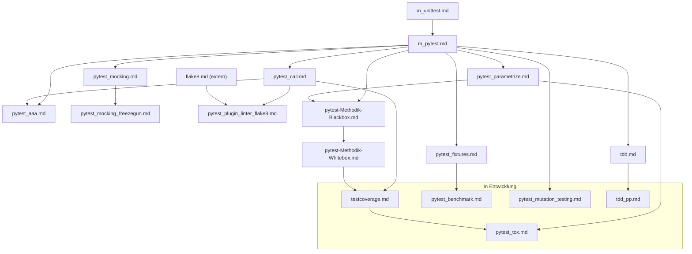

title: Unittests
---
Unit-Tests sind automatisierte Tests, die einzelne Komponenten einer Software isoliert prüfen.
Sie bilden das Fundament jeder professionellen Testpyramide: schnell, granular und reproduzierbar.

In dieser Taskgroup lernen Sie zunächst Pythons Standard-Testframework `unittest`,
dann das leistungsfähigere `pytest`-Ökosystem.
Aufbauend darauf werden systematische Testmethodik (Blackbox/Whitebox),
wichtige pytest-Features (Fixtures, Mocking, Parametrisierung)
sowie Test-Driven Development behandelt.

**Empfohlener Einstiegspfad:**
`m_unittest` → `m_pytest` → `pytest_call` → thematische Vertiefung nach Interesse

## Abhängigkeitsdiagramm der Unittest-Tasks

```mermaid
graph TD
    m_unittest["m_unittest.md"]
    m_pytest["m_pytest.md"]
    pytest_call["pytest_call.md"]
    pytest_parametrize["pytest_parametrize.md"]
    pytest_aaa["pytest_aaa.md"]
    pytest_fixtures["pytest_fixtures.md"]
    pytest_mocking["pytest_mocking.md"]
    pytest_mocking_freezegun["pytest_mocking_freezegun.md"]
    pytest_plugin_linter_flake8["pytest_plugin_linter_flake8.md"]
    tdd["tdd.md"]
    pytest_methodik_blackbox["pytest-Methodik-Blackbox.md"]
    pytest_methodik_whitebox["pytest-Methodik-Whitebox.md"]
    flake8_ext["flake8.md (extern)"]

    subgraph draft_group ["In Entwicklung"]
        testcoverage["testcoverage.md"]
        pytest_benchmark["pytest_benchmark.md"]
        pytest_tox["pytest_tox.md"]
        pytest_mutation_testing["pytest_mutation_testing.md"]
        tdd_pp["tdd_pp.md"]
    end

    m_unittest --> m_pytest
    m_pytest --> pytest_call
    m_pytest --> pytest_parametrize
    m_pytest --> pytest_aaa
    m_pytest --> pytest_fixtures
    m_pytest --> pytest_mocking
    m_pytest --> tdd
    m_pytest --> pytest_methodik_blackbox
    m_pytest --> pytest_mutation_testing
    pytest_call --> pytest_aaa
    pytest_call --> pytest_plugin_linter_flake8
    pytest_call --> testcoverage
    pytest_parametrize --> pytest_methodik_blackbox
    pytest_parametrize --> pytest_tox
    pytest_methodik_blackbox --> pytest_methodik_whitebox
    pytest_methodik_whitebox --> testcoverage
    pytest_mocking --> pytest_mocking_freezegun
    pytest_fixtures --> pytest_benchmark
    tdd --> tdd_pp
    testcoverage --> pytest_tox
    flake8_ext --> pytest_plugin_linter_flake8
```

## Thematische Übersicht

### Grundlagen

- **m_unittest.md**: Einführung in Pythons Standard-Testframework `unittest`.
  Ausgangspunkt für alle weiteren Tasks in dieser Gruppe.
- **m_pytest.md**: Wechsel auf `pytest`, das leistungsfähigere Framework der professionellen Praxis.
  Setzt `m_unittest.md` voraus und ist Grundlage für alle weiteren pytest-Tasks.

### Teststruktur & Methodik

- **pytest_aaa.md**: Das Arrange-Act-Assert-Muster als strukturierende Konvention für lesbare Unit-Tests.
  Setzt `m_pytest.md` und `pytest_call.md` voraus.
- **pytest_parametrize.md**: Tabellengesteuerte Tests mit `@pytest.mark.parametrize`.
  Setzt `m_pytest.md` voraus; Grundlage für Blackbox-Testing.
- **pytest-Methodik-Blackbox.md**: Systematisches Blackbox-Testing mit Äquivalenzklassen und Randwertanalyse.
  Setzt `m_pytest.md` und `pytest_parametrize.md` voraus.
- **pytest-Methodik-Whitebox.md**: Whitebox-Testmethodik und strukturierte Testfallableitung aus dem Quellcode.
  Setzt `pytest-Methodik-Blackbox.md` voraus.

### pytest-Features

- **pytest_call.md**: Steuerung der Testausführung – Selektion, Konfiguration, Kommandozeilenoptionen.
  Setzt `m_pytest.md` voraus.
- **pytest_fixtures.md**: Wiederverwendbare Vor- und Nachbedingungen mit pytest-Fixtures.
  Setzt `m_pytest.md` voraus.
- **pytest_mocking.md**: Abhängigkeiten mit `unittest.mock` isolieren und ersetzen.
  Setzt `m_pytest.md` voraus.
- **pytest_mocking_freezegun.md**: Zeitabhängige Tests mit der `freezegun`-Bibliothek.
  Setzt `pytest_mocking.md` voraus.

### Werkzeuge & Integration

- **pytest_plugin_linter_flake8.md**: Code-Qualitätsprüfung mit dem Flake8-Plugin direkt in pytest.
  Setzt `pytest_call.md` und die externe Task
  [`flake8.md`](../../Werkzeuge/Linter/flake8.md) voraus.

### Test-Driven Development

- **tdd.md**: Einführung in Test-Driven Development am Beispiel FizzBuzz mit pytest.
  Setzt `m_pytest.md` voraus.

### In Entwicklung

Diese Tasks sind noch nicht veröffentlicht (`stage: draft`) und werden künftig verfügbar sein:

- **testcoverage.md**: Code Coverage mit `pytest-cov` messen, interpretieren und kritisch bewerten.
  Setzt `pytest_call.md` und `pytest-Methodik-Whitebox.md` voraus.
- **tdd_pp.md**: TDD im Pair Programming. Setzt `tdd.md` voraus.
- **pytest_benchmark.md**: Performance-Benchmarks mit `pytest-benchmark`. Setzt `pytest_fixtures.md` voraus.
- **pytest_tox.md**: Testen in mehreren Python-Umgebungen mit `tox`.
  Setzt `pytest_parametrize.md` und `testcoverage.md` voraus.
- **pytest_mutation_testing.md**: Mutation Testing zur Qualitätsbewertung von Tests. Setzt `m_pytest.md` voraus.
