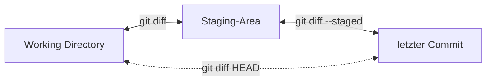

title: Änderungen vergleichen und Historie
stage: draft
timevalue: 1.5
difficulty: 2
explains:
requires: git-Objektmodell
---

[SECTION::goal::experience]
Ich kann mit `git diff` gezielt Änderungen zwischen den drei Bereichen vergleichen
und mit `git log` die Commit-Historie durchsuchen und filtern.
[ENDSECTION]

[SECTION::background::default]
In [PARTREF::git-Objektmodell] haben Sie gelernt, dass Git drei Bereiche kennt:
Working Directory, Staging-Area und Repository.
Jetzt lernen Sie zwei Werkzeuge kennen, die dieses Modell im Alltag praktisch nutzbar machen:
`git diff` zeigt, *was* sich verändert hat, `git log` zeigt, *wann* und *warum*.
[ENDSECTION]

[SECTION::instructions::detailed]

Sie arbeiten weiter in Ihrem Taschenrechner-Repository.
Dort sollten sich zwei Commits befinden (Addition und Multiplikation).

### Die drei Vergleiche: `git diff`

Rufen Sie zunächst die Dokumentation zu `git diff` auf (`git help diff`).
Das ist eine Menge Stoff, das meiste davon brauchen Sie noch nicht.
Schauen Sie sich vor allem den Abschnitt *EXAMPLES* an.

Aus dem Drei-Bereiche-Modell ergeben sich drei sinnvolle Vergleiche:



Um alle drei Vergleiche in Aktion zu sehen, brauchen Sie einen Zustand, 
in dem sich alle drei Bereiche unterscheiden.

Fügen Sie `calculator.py` eine neue Funktion als Skelett hinzu:

```python
# Ein einfacher Rechner

def addiere(a, b):
    # Diese Funktion addiert zwei Zahlen
    return a + b

def multipliziere(a, b):
    # Diese Funktion multipliziert zwei Zahlen
    return a * b

def subtrahiere(a, b):
    ...

```

Fügen Sie diese Änderung mit `git add` zur Staging-Area hinzu.

Implementieren Sie die Funktion jetzt gleich weiter, **ohne erneut** `git add` auszuführen:

```python
# Ein einfacher Rechner

def addiere(a, b):
    # Diese Funktion addiert zwei Zahlen
    return a + b

def multipliziere(a, b):
    # Diese Funktion multipliziert zwei Zahlen
    return a * b

def subtrahiere(a, b):
    # Diese Funktion subtrahiert zwei Zahlen
    return a - b

```

Jetzt unterscheiden sich alle drei Bereiche:

- Der **letzte Commit** kennt nur Addition und Multiplikation.
- Die **Staging-Area** enthält zusätzlich das Subtraktions-Skelett.
- Das **Working Directory** enthält die vollständige Subtraktions-Implementierung.

[EC] Vergleichen Sie den aktuellen Zustand der Datei im Working Directory 
mit den bereits vorgemerkten Änderungen in der Staging-Area.

[EC] Vergleichen Sie die vorgemerkten Änderungen in der Staging-Area 
mit dem letzten Commit.

[EC] Vergleichen Sie den aktuellen Zustand im Working Directory 
direkt mit dem letzten Commit.

[EQ] Das Skelett von `subtrahiere` ist noch nicht committet. 
Trotzdem taucht es in der Ausgabe von `git diff` ohne Argumente nicht auf. Warum?

[EQ] Git speichert vollständige Snapshots, keine Diffs. 
Wie erzeugt es dann die Ausgabe von `git diff`?

### `git status` mit neuen Augen

Führen Sie `git status` aus. 
In der vorherigen Aufgabe haben Sie gesehen, dass `git status` auch Befehle vorschlägt.

[EQ] Welche Befehle schlägt `git status` vor, und was tun sie?
Schauen Sie bei unbekannten Befehlen in `git help` nach.
Sie werden diese Befehle in einer späteren Aufgabe üben; 
für jetzt reicht es, ihre Funktion zu kennen.

Sie können sich mit `git status` auch direkt die Änderungen anzeigen lassen,
die beim nächsten Commit gespeichert würden, und separat die Änderungen, 
die noch nicht in der Staging-Area sind.

[EQ] Wie geht das? (Tipp: Schauen Sie in `git help status` nach den *verbose*-Optionen.)

### Commit erstellen

Fügen Sie die verbleibenden Änderungen dem Index hinzu und erstellen Sie einen Commit 
mit einer passenden Nachricht.

### `git log`: Die Commit-Historie

Nicht selten wollen Sie nicht nur vorwärts arbeiten, 
sondern auch in die Vergangenheit schauen,
sei es, um einen alten Zustand zu betrachten oder um zu prüfen, 
welche Commits im Repository existieren.

`git log` ist Ihr Git-Tagebuch. 
Wenn Sie es ohne Argumente aufrufen, sehen Sie für jeden Commit:

1. den Commit-Hash
2. den Autor
3. das Datum
4. die Commit-Nachricht

Das ist bei drei Commits noch übersichtlich, 
aber bei Hunderten oder Tausenden Commits wird es schnell unübersichtlich.
Deswegen hat `git log` viele nützliche Optionen.
Schauen Sie ruhig in die Dokumentation. 
Dort werden Sie *sehr viele* Optionen finden, 
von denen Sie die meisten aktuell nicht brauchen werden.

Für den Anfang sind folgende besonders nützlich:

**`--oneline`** reduziert jeden Commit auf eine einzige Zeile.
Hilfreich bei langer Historie.

**`-p`** erzeugt für jeden Commit einen sogenannten Patch-Text,
im Prinzip ein Diff über alle veränderten Dateien.
Das ist so, als würde man `git diff` zwischen jedem Commit und seinem Vorgänger ausführen.

Beachten Sie: `git log -p` zeigt für jeden Commit die *Änderungen* gegenüber dem Vorgänger.
Das ist eine zweite Sicht auf Commits.
In [PARTREF::git-Objektmodell] haben Sie gelernt, dass ein Commit ein vollständiger 
Snapshot ist, ein Abbild aller Dateien zu einem bestimmten Zeitpunkt.
Aber man kann denselben Commit auch als *Änderungsoperation* betrachten:
„Was wurde gegenüber dem vorherigen Zustand verändert?“
Beide Sichten sind korrekt und nützlich.
Sie werden in einer späteren Aufgabe sehen, dass manche Git-Befehle die eine, 
manche die andere Sicht verwenden.

**`-- <Dateipfad>`** zeigt nur Commits, die eine bestimmte Datei verändert haben.

[EQ] Wie muss der `git log`-Befehl lauten, um alle Commits und deren Änderungen 
an der Datei `calculator.py` anzuzeigen?

### Weitere nützliche Log-Optionen

In größeren Repositories ist es oft nützlich, Commits nach Datum zu filtern:

- `--since <date>` bzw. `--after <date>`: Commits nach einem bestimmten Datum
- `--until <date>` bzw. `--before <date>`: Commits vor einem bestimmten Datum

Außerdem praktisch ist die Suche nach Autor:

```bash
git log --author="Max Mustermann"
git log --author=Max
```

Das Argument wird entweder als vollständiger Autorenname oder als Teilstring gesucht.
Das ist besonders hilfreich, wenn mehrere Personen am gleichen Repository arbeiten.

Eine weitere Option, die in einer späteren Aufgabe über Branches sehr nützlich wird:

```bash
git log --oneline --graph --all
```

`--graph` zeichnet die Commit-Historie als ASCII-Graphen, 
und `--all` zeigt auch Commits auf anderen Branches.
Bei Ihrem linearen Repository mit einem Branch sieht das noch unspektakulär aus,
aber sobald Branches ins Spiel kommen, wird es unverzichtbar.

### Fazit

Sie haben jetzt drei Werkzeuge, um jederzeit zu verstehen, 
was in Ihrem Repository passiert:

- `git status` zeigt den **aktuellen Zustand** (was ist geändert, was ist vorgemerkt).
- `git diff` zeigt die **konkreten Änderungen** zwischen den drei Bereichen.
- `git log` zeigt die **Geschichte** aller Commits.

Zusammen mit dem Drei-Bereiche-Modell aus der letzten Aufgabe können Sie sich jetzt 
in jeder Situation orientieren.

[ENDSECTION]

[SECTION::submission::trace]
[INCLUDE::/_include/Submission-Kommandoprotokoll.md]
[INCLUDE::/_include/Submission-Markdowndokument.md]
[ENDSECTION]

[INSTRUCTOR::Prüfhinweise]
Prüfen Sie das Protokoll und die Antworten.

[INCLUDE::ALT:]

[ENDINSTRUCTOR]