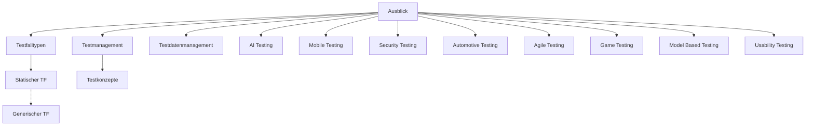
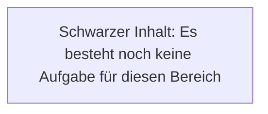
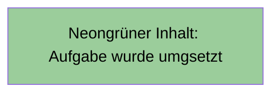
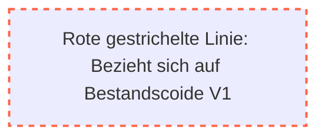
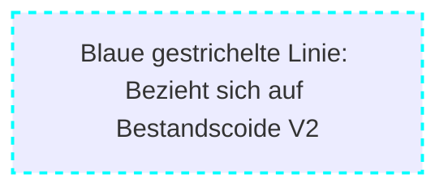
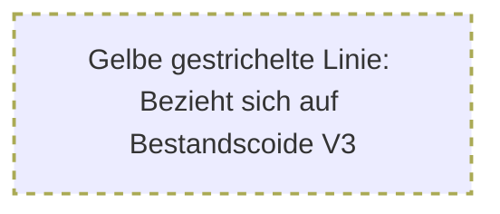

description: >
  Was ist das Testen in der Softwareentwicklung und wie wird es durchgeführt?
---

Softwaretesten ist ein umfassendes Thema, das verschiedene Bereiche und Aspekte abdeckt. Es gibt verschiedene
Teststrategien und -ansätze, die in der Softwareentwicklung verwendet werden, um sicherzustellen, dass eine Anwendung
(fehlerfrei und) gem. den Anforderungen funktioniert.

In diesem Kapitel geht es um die Qualität der Software, die durch Testmanager, Test Leiter, Test Analysten,
Testautomatisierer und Test Architekten (allg. Tester) optimiert werden kann. Hier erlenen Sie die Grundlagen des
Testens, betrachten Konzeptionen und lassen den Spaß, das Programmieren, definitiv im Themenbereich Testautomatisierung
nicht außen vor.

Im folgenden Diagram erhalten Sie eine grobe Übersicht übe die möglichen Themen, die Sie bearbeiten können.

```mermaid
graph TD
    A[Softwaretesten] --> B[Basiswissen]

    A --> C[SuT]
    C --> CA[Vorstellung des SuT]
    CA --> CA1[Bestandscode v1.0.0]
    CA1 -.-> CA2[Bestandscode v1.1.0]
    CA2 -.-> CA3[Bestandscode v3.0.0]
    CA --> CB[Übung: Implementierung]
    CB --> CB1[Übung: IDE]
    CB --> CB2[Übung: GitHub Action]

    A --> D[Manuelles Testen]
    D --> DA[Übung: Testfälle erstellen]
    DA -.-> DB[Übung: Fehlerberichterstattung]

    A --> E[Automatisiertes Testen]
    E --> EA[Testautomatisierungstools]
    EA --> EA0[Unit Tests]
    EA0 --> EA1[Übung: Pytest]
    EA0 --> EA01[Übung: Unittest]
    EA --> EA2[Übung: Robot Framework]
    EA --> EA3[Übung: Cypress]
    EA --> EA4[Übung: Cycumber mit Cypress]
    EA --> EA5[Übung: Locust - API]
    EA5 --> EA51[Übung: Verteilte LuP-Tests]
    EA --> EA6[Übung: JMeter - Capture and Replay]
    EA6 --> EA61[Übung: Verteilte LuP-Tests]
    EA --> EA7[Übung: SonarQube]
    EA --> EA8[Übung: Nessus]
    EA01 ---> EA9[Übung: Pipelining GitHub Action / Gitlab CI]
    EA1 ---> EA9[Übung: Pipelining GitHub Action / Gitlab CI]
    EA2 ---> EA9[Übung: Pipelining GitHub Action / Gitlab CI]
    EA3 ---> EA9[Übung: Pipelining GitHub Action / Gitlab CI]
    EA4 ---> EA9[Übung: Pipelining GitHub Action / Gitlab CI]
    EA5 ---> EA9[Übung: Pipelining GitHub Action / Gitlab CI]
    EA51 ---> EA9[Übung: Pipelining GitHub Action / Gitlab CI]
    EA6 ---> EA9[Übung: Pipelining GitHub Action / Gitlab CI]
    EA61 ---> EA9[Übung: Pipelining GitHub Action / Gitlab CI]
    EA7 ---> EA9[Übung: Pipelining GitHub Action / Gitlab CI]
    EA8 ---> EA9[Übung: Pipelining GitHub Action / Gitlab CI]
    EA9 ---> EA10[Übung: Umsetzung CI / CD]

    E --> EB[Testarten]
    EB --> EB1[Übung: Unittests / TDD]
    EB --> EB2[Übung: Integrationstests]
    EB --> EB3[Übung: Systemtests]
    EB --> EB4[Übung: Last- und Performance Tests]
    EB --> EB5[Übung: Sicherheitstests]
    EB --> EB6[Übung: Linter]

    %% Stil für die Knoten
    style B fill:#9BCD9B,color:Black
    style EA0 fill:#9BCD9B,color:Black
    style EA1 fill:#9BCD9B,color:Black
    style EA01 fill:#9BCD9B,color:Black

    style CA1 stroke:#ff6347,stroke-width:2px,stroke-dasharray:5,5
    style CB1 stroke:#ff6347,stroke-width:2px,stroke-dasharray:5,5 
    style CB2 stroke:#ff6347,stroke-width:2px,stroke-dasharray:5,5 

    style DA stroke:#ff6347,stroke-width:2px,stroke-dasharray:5,5
    style DB stroke:#ff6347,stroke-width:2px,stroke-dasharray:5,5
    style EA01 stroke:#ff6347,stroke-width:2px,stroke-dasharray:5,5
    style EA1 stroke:#ff6347,stroke-width:2px,stroke-dasharray:5,5
    style EA2 stroke:#ff6347,stroke-width:2px,stroke-dasharray:5,5
    style EA3 stroke:#ff6347,stroke-width:2px,stroke-dasharray:5,5
    style EA4 stroke:#ff6347,stroke-width:2px,stroke-dasharray:5,5
    style EA5 stroke:#ff6347,stroke-width:2px,stroke-dasharray:5,5
    style EA6 stroke:#ff6347,stroke-width:2px,stroke-dasharray:5,5
    style EA7 stroke:#ff6347,stroke-width:2px,stroke-dasharray:5,5
    style EA8 stroke:#ff6347,stroke-width:2px,stroke-dasharray:5,5
    style EB1 stroke:#ff6347,stroke-width:2px,stroke-dasharray:5,5
    style EB2 stroke:#ff6347,stroke-width:2px,stroke-dasharray:5,5
    style EB3 stroke:#ff6347,stroke-width:2px,stroke-dasharray:5,5
    style EB4 stroke:#ff6347,stroke-width:2px,stroke-dasharray:5,5
    style EB5 stroke:#ff6347,stroke-width:2px,stroke-dasharray:5,5
    style EB6 stroke:#ff6347,stroke-width:2px,stroke-dasharray:5,5

    style CA2 stroke:#00FFFF,stroke-width:2px,stroke-dasharray:5,5
    style EA51 stroke:#00FFFF,stroke-width:2px,stroke-dasharray:5,5
    style EA61 stroke:#00FFFF,stroke-width:2px,stroke-dasharray:5,5

    style CA3 stroke:#AAAA55,stroke-width:2px,stroke-dasharray:5,5
```

### Ausblick

Das Feld des Softwaretestens birgt noch zahlreiche weitere spezialisierte Themen, die hier aktuell noch nicht behandelt werden konnten. Für interessierte hier ein kleiner Überblick:

### Legende

