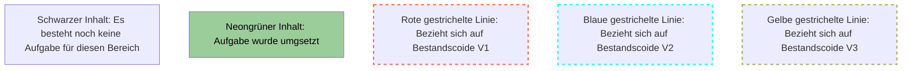

description: >
  Wie schreibt man automatisierte Tests, die viel Zutrauen bringen
  ohne einen Wahnsinns-Aufwand für Erstellung und Pflege zu benötigen?
---

Softwaretesten ist ein umfassendes Thema, das verschiedene Bereiche und Aspekte abdeckt. Es gibt verschiedene
Teststrategien und -ansätze, die in der Softwareentwicklung verwendet werden, um sicherzustellen, dass eine Anwendung
(fehlerfrei und) gem. den Anforderungen funktioniert.

**Manuelles Testen** ist ein wesentlicher Bestandteil des Softwaretestprozesses und umfasst verschiedene Aspekte wie
Funktionalitätsprüfung, exploratives Testen, Usability-Tests, Akzeptanztests und Regressionstests. Hierbei werden
Testfälle von menschlichen Testern manuell ausgeführt, um sicherzustellen, dass die Software den funktionalen
Anforderungen entspricht, Benutzerfreundlich ist und/oder den Akzeptanzkriterien gerecht wird.

**Automatisiertes Testen** ist ein effizienter Ansatz, der die Verwendung von Skripten und Tools zur automatisierten
Ausführung von Testfällen beinhaltet. Zu den Hauptbereichen gehören Unit Testing, Integrationstests, Regressionstests
und Leistungstests. Dieser Ansatz trägt dazu bei, den Testprozess zu beschleunigen, die Konsistenz der Testergebnisse
sicherzustellen und ermöglicht auch die Durchführung umfangreicher Last- und Leistungstests.

Die effektive Organisation und Steuerung des gesamten Testprozesses erfordert **Testmanagement**, was die Planung,
Testfallerstellung, Testausführung, Fehlerverwaltung, Berichterstellung, Testautomatisierung und die Verwaltung von
Testumgebung und -daten einschließt. Ein gutes Testmanagement gewährleistet die Ordnungsmäßigkeit und
Nachvollziehbarkeit der Tests sowie die effiziente Zusammenarbeit zwischen den Testteams und anderen Stakeholdern.

Die verschiedenen **Testarten und -ziele** spielen eine entscheidende Rolle beim Testen der Software. Hierbei werden
Funktionalitätstests durchgeführt, um sicherzustellen, dass die Software die funktionalen Anforderungen erfüllt.
Nicht-funktionale Tests konzentrieren sich auf Aspekte wie Leistung, Sicherheit und Benutzerfreundlichkeit.
Sicherheitstests decken Schwachstellen und Sicherheitslücken auf, während Usability-Tests die Benutzerfreundlichkeit
bewerten. Kompatibilitätstests stellen sicher, dass die Software auf verschiedenen Plattformen und Geräten
ordnungsgemäß funktioniert, und Performance- und Leistungstests prüfen die Software unter verschiedenen Belastungen
und Bedingungen.

In diesem Kapitel geht es um die Qualität der Software, die durch Testmanager, Test Leiter, Test Analysten,
Testautomatisierer und Test Architekten (allg. Tester) optimiert werden kann. Hier betrachten wir den Nutzen des
Testens (Return On Invest), erlenen die Grundlagen des Testens, betrachten Konzeptionen und lassen den Spaß, das
Programmieren, definitiv im Thema Testautomatisierung nicht außen vor.

```mermaid
graph TD
    A[Softwaretesten] -->|enthält| B[Basiswissen]
    B --> BA[Übung: Fehler, Defekt, Fehlerart]
    B --> BB[Übung: Testen, Debuggen, Qualitätssicherung]
    B --> BC[Übung: Testfall, Testsammlung, Testplan, Testdaten]

    A -->|enthält| C[SuT]
    C --> CA[Vorstellung des SuT]
    CA --> CA1[Bestandscode v1.0.0]
    CA1 -.-> CA2[Bestandscode v1.1.0]
    CA2 -.-> CA3[Bestandscode v3.0.0]
    CA --> CB[Übung: Implementierung]
    CB --> CB1[Übung: IDE]
    CB --> CB2[Übung: GitHub Action]

    A -->|enthält| D[Manuelles Testen]
    D --> DA[Übung: Testfälle erstellen]
    DA -.-> DB[Übung: Fehlerberichterstattung]

    A -->|enthält| E[Automatisiertes Testen]
    E --> EA[Testautomatisierungstools]
    EA --> EA0[Übung: Unittest]
    EA0 --> EA1[Übung: Pytest]
    EA --> EA2[Übung: Robot Framework]
    EA --> EA3[Übung: Cypress]
    EA --> EA4[Übung: Cycumber mit Cypress]
    EA --> EA5[Übung: Locust - API]
    EA5 --> EA51[Übung: Verteilte LuP-Tests]
    EA --> EA6[Übung: JMeter - Capture and Replay]
    EA6 --> EA61[Übung: Verteilte LuP-Tests]
    EA --> EA7[Übung: SonarQube]
    EA --> EA8[Übung: Nessus]
    EA0 ---> EA9[Übung: Pipelining GitHub Action / Gitlab CI]
    EA1 ---> EA9[Übung: Pipelining GitHub Action / Gitlab CI]
    EA2 ---> EA9[Übung: Pipelining GitHub Action / Gitlab CI]
    EA3 ---> EA9[Übung: Pipelining GitHub Action / Gitlab CI]
    EA4 ---> EA9[Übung: Pipelining GitHub Action / Gitlab CI]
    EA5 ---> EA9[Übung: Pipelining GitHub Action / Gitlab CI]
    EA51 ---> EA9[Übung: Pipelining GitHub Action / Gitlab CI]
    EA6 ---> EA9[Übung: Pipelining GitHub Action / Gitlab CI]
    EA61 ---> EA9[Übung: Pipelining GitHub Action / Gitlab CI]
    EA7 ---> EA9[Übung: Pipelining GitHub Action / Gitlab CI]
    EA8 ---> EA9[Übung: Pipelining GitHub Action / Gitlab CI]
    EA9 ---> EA10[Übung: Umsetzung CI / CD]

    E --> EB[Testarten]
    EB --> EB1[Übung: Unittests / TDD]
    EB --> EB2[Übung: Integrationstests]
    EB --> EB3[Übung: Systemtests]
    EB --> EB4[Übung: Last- und Performance Tests]
    EB --> EB5[Übung: Sicherheitstests]
    EB --> EB6[Übung: Linter]

    A -->|enthält| F[Testdatenmanagement]
    F --> FA[Übung: Statischer TF]
    FA -.-> FB[Übung: Generischer TF]

    %% Stil für die Knoten
    style B fill:#9BCD9B,color:Black
    style BA fill:#9BCD9B,color:Black
    style BB fill:#9BCD9B,color:Black
    style BC fill:#9BCD9B,color:Black

    style CA1 stroke:#ff6347,stroke-width:2px,stroke-dasharray:5,5
    style CB1 stroke:#ff6347,stroke-width:2px,stroke-dasharray:5,5 
    style CB2 stroke:#ff6347,stroke-width:2px,stroke-dasharray:5,5 
    style CB stroke:#ff6347,stroke-width:2px,stroke-dasharray:5,5 
    style DA stroke:#ff6347,stroke-width:2px,stroke-dasharray:5,5
    style DB stroke:#ff6347,stroke-width:2px,stroke-dasharray:5,5
    style EA0 stroke:#ff6347,stroke-width:2px,stroke-dasharray:5,5
    style EA1 stroke:#ff6347,stroke-width:2px,stroke-dasharray:5,5
    style EA2 stroke:#ff6347,stroke-width:2px,stroke-dasharray:5,5
    style EA3 stroke:#ff6347,stroke-width:2px,stroke-dasharray:5,5
    style EA4 stroke:#ff6347,stroke-width:2px,stroke-dasharray:5,5
    style EA5 stroke:#ff6347,stroke-width:2px,stroke-dasharray:5,5
    style EA6 stroke:#ff6347,stroke-width:2px,stroke-dasharray:5,5
    style EA7 stroke:#ff6347,stroke-width:2px,stroke-dasharray:5,5
    style EA8 stroke:#ff6347,stroke-width:2px,stroke-dasharray:5,5
    style EB1 stroke:#ff6347,stroke-width:2px,stroke-dasharray:5,5
    style EB2 stroke:#ff6347,stroke-width:2px,stroke-dasharray:5,5
    style EB3 stroke:#ff6347,stroke-width:2px,stroke-dasharray:5,5
    style EB4 stroke:#ff6347,stroke-width:2px,stroke-dasharray:5,5
    style EB5 stroke:#ff6347,stroke-width:2px,stroke-dasharray:5,5
    style EB6 stroke:#ff6347,stroke-width:2px,stroke-dasharray:5,5
    style FA stroke:#ff6347,stroke-width:2px,stroke-dasharray:5,5


    style CA2 stroke:#00FFFF,stroke-width:2px,stroke-dasharray:5,5
    style FB stroke:#00FFFF,stroke-width:2px,stroke-dasharray:5,5
    style EA51 stroke:#00FFFF,stroke-width:2px,stroke-dasharray:5,5
    style EA61 stroke:#00FFFF,stroke-width:2px,stroke-dasharray:5,5

    style CA3 stroke:#AAAA55,stroke-width:2px,stroke-dasharray:5,5
```

Legende:

